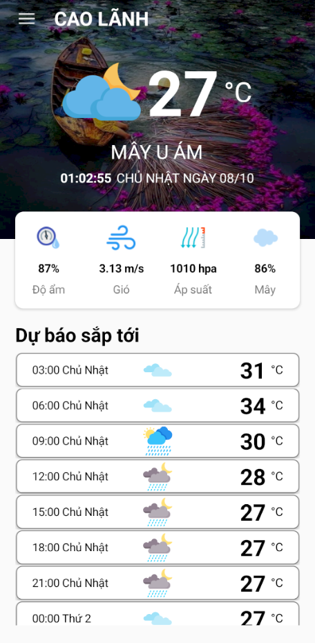

# WeatherApp

## Image Demo


## Introduction
WeatherApp is a simple and user-friendly mobile application developed using *Xamarin.Forms* to provide weather forecasts for users. This app uses the *OpenWeather API* to fetch real-time weather information and forecasts.

## Key Features
- Display real-time weather information.
- Allow users to search for weather information for different regions of Vietnam by selecting a region in the navigation bar.
- Display weather forecasts for the future with details such as temperature, humidity, wind speed, and weather description.
- Integrate weather illustrations to enhance the user experience.

## Installation and Configuration
1. Clone this repository to your computer: git clone https://github.com/NguyenDacCuong2604/WeatherApp.git
2. Open the project using Visual Studio or Visual Studio Code (ensure you have Xamarin and the appropriate SDK installed).
3. Configure your OpenWeather API Key in your project. You need to register an OpenWeather account and obtain your API Key.
4. Change the value of OpenWeatherApiKey in the AppSettings.cs file to your API Key:
```
public partial class CurrentWeatherPage : ContentPage
{
    public static string OpenWeatherApiKey = "YOUR_OPENWEATHER_API_KEY";
}
```

5. Set up target devices or emulators to run the Xamarin app on Android or iOS.

## Technologies and Libraries
- Xamarin.Forms: Used to develop the cross-platform user interface.
- OpenWeather API: Used to fetch real-time weather data and forecasts.

## Contributions
We welcome contributions from the community. If you'd like to add new features, fix bugs, or enhance the app, please create a pull request.

## Author
- Name: [NguyenDacCuong2604](https://github.com/NguyenDacCuong2604)
- Email: [20130215@st.hcmuaf.edu.vn]
- Facebook [Nguyễn Đắc Cường](https://www.facebook.com/nguyendaccuong2002/)